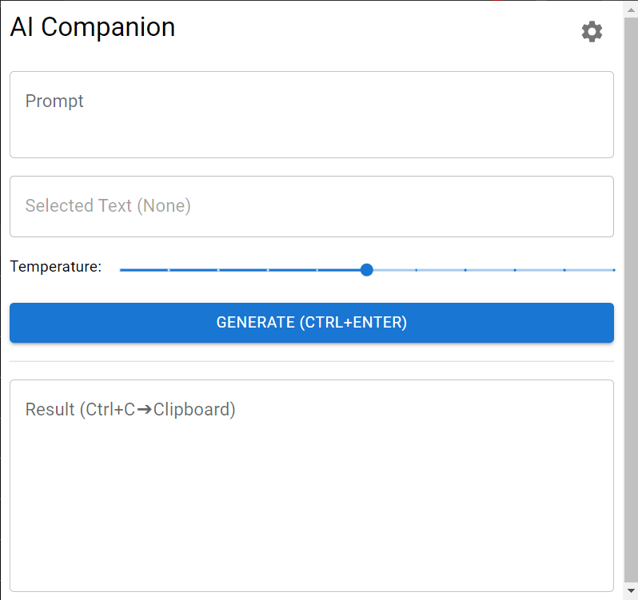

## AI Companion Chrome Extension

This is a Chrome extension that provides a quick and easy way to access to GPT-3 from within your browser. It can be used as a handy alternative to the OpenAI Playground that is always available and doesn't require you to open a new tab.

AI Companion uses the OpenAI GPT-3 API with your own API key ("Bring your own key").



### Installation

Run the following:

```bash
pnpm build
# or
npm run build
```

Then, in Chrome, go to `chrome://extensions` and click "Load unpacked" and select the `build/chrome-mv3-prod` directory. 

### Setup

1. Create an account at [OpenAI](https://beta.openai.com/).
2. Copy your OpenAI API key and paste it in the extension options page.

### Usage

1. Select some text on a webpage.
2. Open the extension popup (click the extension icon in the toolbar).
3. In the popup, the selected text will be displayed as {SELECTION}.
4. Give some instructions to GPT-3 and click "Generate".

### Examples

> Translate to English: {SELECTION}
> Definition of {SELECTION}:
> What is {SELECTION}?
